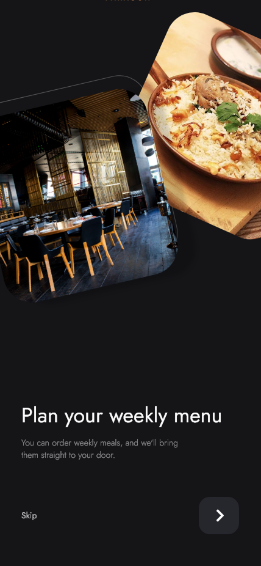
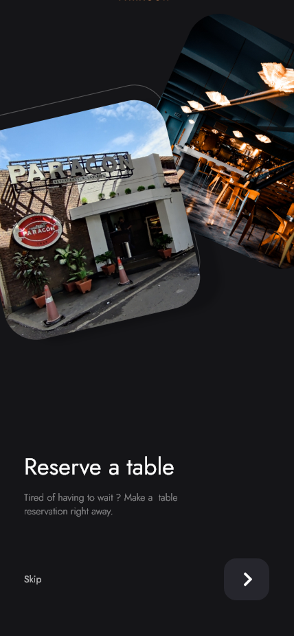
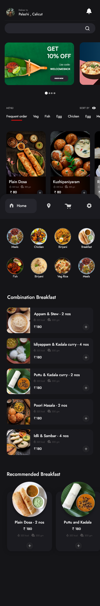
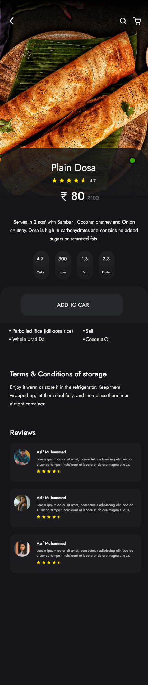
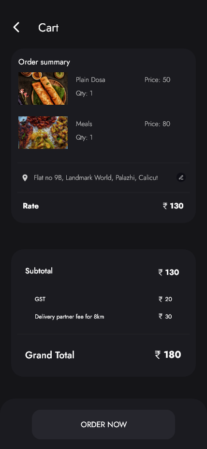
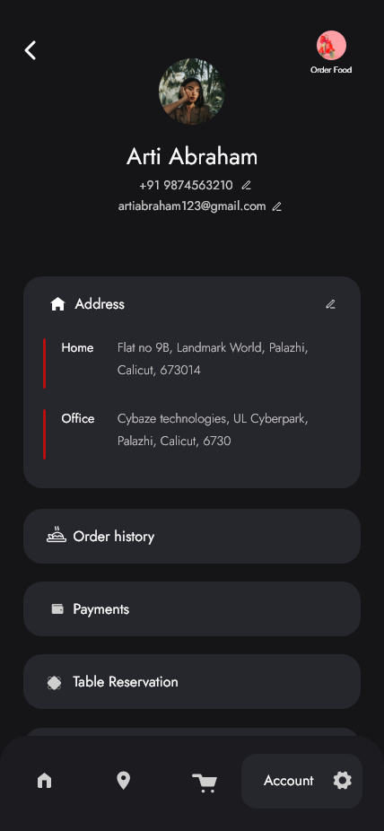

# Taste Flow Food Ordering App

**Taste Flow** is an intuitive Android application that allows users to effortlessly browse through local restaurants, explore their menus, customize food orders, and complete transactions in a seamless manner. With a smooth and user-friendly interface, the app provides a delightful food ordering experience for users looking to enjoy their favorite meals.

## Features

- **Browse Restaurants**: Easily discover a variety of nearby restaurants based on your preferences or location.
- **View Menus**: Explore detailed restaurant menus, including food descriptions, images, and customization options.
- **Customizable Orders**: Customize your food orders by selecting portion sizes, toppings, and special instructions.
- **Cart Management**: Add or remove items from your cart and easily modify your order before checkout.
- **Secure Payment Gateway**: Enjoy safe and secure payment methods, such as credit/debit cards and other options.
- **Order Tracking**: Track your order in real-time and receive updates on its preparation and delivery status.
- **User Profiles**: Create an account to save your favorite restaurants, dishes, and order history for quicker access in the future.
- **Push Notifications**: Stay updated with notifications about order statuses, promotions, and new offers.
- **Ratings and Reviews**: Rate your food and share reviews for restaurants, helping the community make better dining decisions.
- **Personalized Recommendations**: Get recommendations based on your order history and preferences.

## Technologies Used

- **Java** for Android app development.
- **Firebase** for authentication, database storage, and push notifications.
- **Glide** for efficient image loading and caching.
- **Retrofit** for making API calls to interact with the backend.

## Screenshots

Here’s a preview of the app:

### Onboarding Screens



### Home Screen


### Product Screen


### Cart Page


### Account Flow


## Installation

### Prerequisites
To get started, make sure you have the following:

- **Android Studio** installed. Download it from [here](https://developer.android.com/studio).
- **SDK**: Ensure you have the Android SDK set up and up to date.
- **Firebase Setup**: You’ll need to set up Firebase for authentication, real-time database, and notifications. You can follow Firebase setup instructions [here](https://firebase.google.com/docs/android/setup).

### Steps to Run Locally

1. Clone the repository:

    ```bash
    git clone https://github.com/Rohith1034/Taste-Flow
    ```

2. Open the project in **Android Studio**.

3. Sync the project with Gradle files. Click **Sync Now** in Android Studio when prompted.

4. Set up **Firebase** for authentication, database, and push notifications. Create a project in the Firebase console and integrate the `google-services.json` file into your project.

5. Make sure you’ve updated the necessary configurations, like API keys for the payment gateway and location services.

6. Build and run the app on an emulator or a physical device.

## Contributing

We welcome contributions to **Taste Flow**! If you want to contribute to the development of this app, here’s how you can get involved:

1. Fork the repository.
2. Create a new branch for your feature or bug fix.
3. Make your changes and commit them.
4. Push your changes to your forked repository.
5. Open a pull request with a clear description of the changes you've made.

Please make sure your changes are well-tested and include necessary documentation.

## License

This project is licensed under the MIT License. See the [LICENSE](LICENSE) file for more details.

## Contact

If you have any questions or feedback, feel free to reach out:

- **Email**: support@tasteflow.com
- **GitHub**: [your-github-profile](https://github.com/Rohith1034)
- **Website**: [www.tasteflow.com](http://www.tasteflow.com)
